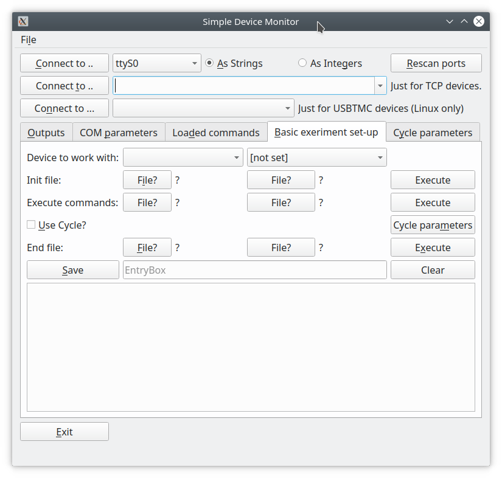

# Introduction

The **Simple Device Monitor** is quite simple application targeted to control or watch laboratory devices under Linux and Windows operating systems.

The other purpose was to have general application able to connect any device and test an output from it.

Sometimes it is useful to have such simple application to test a device ability to work with Linux OS and to check an output and its format from a device.

This applications can connect to **RS232** ( COM ) port-attached devices, as well as to **USB** and **Network** devices. There are few requirements for **USB** and **Network**-based devices:

-  **USB** devices should be compatible with *USBTMC* protocol. In other words - Linux should detect them as **USBTMC** devices and create node */dev/usbtmcN*, where N - {0, 1, 2, ... }
- **Network**-based devices should be compatible with *SCPI* protocol. 
- **RS232** devices should work without any quirks, if these devices do not use very specific protocol.

The Simple Device Monitor uses *python-vxi11* library to communicate with **Network**-based devices, **QtSerialPort** to communicate with *RS232* devices. **USBTMC** devices are treated as regular files, therefore **USBTMC** devices will work under Linux OS only. 

There is a standalone version for Linux users in *../Linux* folder. It should work under any x64 Linux distribution, but it is not tested.

All necessary requirements can be installed using regular package managers such *apt*, *yum* and so on, or using *pip* command, if preferred. 

In order to run this application, a host computer has to have:

- Pyhton 3
- python-vxi11
- QtSerialPort
- PyQt5

Everything can be installed using the following commands (tested under Ubuntu 18.04 LTS):

```bash
sudo apt-get install python3 python3-pyqt5 python3-pyqt5.qtserialport python3-pip
sudo pip3 install python-vxi11
```

If everything is OK, there will be all necessary dependencies automatically installed.

For Windows users, there is a standalone version in a *../Windows* directory, tested under Windows 10, 64-bit.


# Usage and Limitations


The Simple Device Monitor able to connect up to three different-connected devices. For example, it is possible to connect to one **RS232** device, to one **USBTMC** device and to one *Networked* device, but it is impossible to have more than one **RS232** device at the same time.

It is impossible to send commands to all devices at the same time - you need to specify exact device to work with.

There is an ability to load a bunch of commands from file and it is possible to run very basic experiment with one specified device.
For example, if you need to measure solar cell, resistor and so on and if you have quite expensive source meter such *Keysight B2980*, you can do with this application.

# Command sets

It is possible to write all commands into one file, and send them all without entering command by command.
The structure of command sets is very simple: just write regular **SCPI** commands line by line:
```
*idn?
*rst
```

It is possible to write comments using two backslashes in the beginning of line:

```
//comment
*idn?
//other comment
*rst
```

It is even possible to specify delay between commands with keyword *delay*:

```
//comment
*idn?
delay=5
//other comment
*rst
```

It will delay an execution of the next statement for the 5 seconds. You can specify any time amount you need.

## Set-up of an simple experiment


In order to automatically run some commands, at first write them down into a command set file. It is designed to use three different files, first one for an initialization of device, second one will be commands for the actual experiment, third one will be for the end of an experiment.

For example, first file sets up a source meter, second one contains actual measurement commands, and third file closes and resets an source meter.

If  **▢Use Cycle** is checked, the file with experiment commands will be executed few times. 


Cycle parameters are specified in the '**Cycle parameters**' tab. Here is it possible to choose, if commands need just to be repeated few times, or there is a variable in a script.

If **Steps from to** is chosen, and all next check-boxes are checked, the **Simple Device Monitor** will search specified string in command sets and will replace founded string by current step value.

## Tested devices

This application was tested with the following devices:

- **Keysight B2985A**, source-meter, connected over the **LAN**. Output +, Input +.
- **Keithley 2010**, multi-meter, connected over **RS232** port. Output +, Input +.
- **TGA1010A**, function generator, connected over **RS232** port. Some commands were not working - no output was obtained, but it was possible to set some parameters. The working example is provided in *CmdSet* folder. It looks like all setters (commands for setting some parameters) are working except getters (commands to obtain some values such IDN from **\*idn?**). The reason is pretty weird - the device does not return any bytes into RS232 port.
- **Rigol DS1102E**, osciloscope, connected over **USB**. Working example is provided in *CmdSets* folder.
- **Rigol DP832**, power supply, connected over **USB**. The device responded to *\*idn?* command successfully. Nothing more has been tested. 

Example command sets are provided in a *CmdSets* folder.
